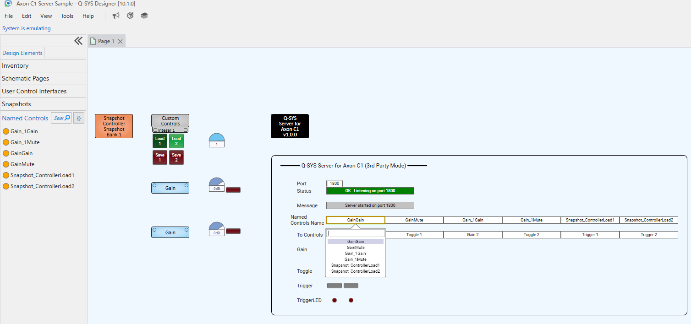

# Q-SYS Plugin: Q-SYS Server for Axon C1

## Overview
This plugin allows the Axon C1 Controller to be used in 3rd party mode by connecting to an arbitrarily specified port instead of connecting to port 1702 using the ECP command format.
With standard ECP, the session is disconnected after 60 seconds, which causes issues with the initial communication after the C1 recovers from standby mode.
This plugin avoids the problems caused by that behavior.
As you know, use this plugin at your own risk.

